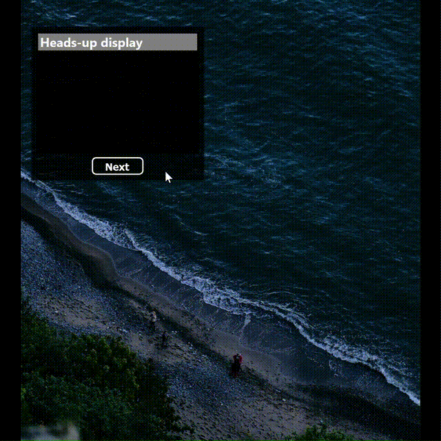

# indoor cycling hud

A simple GUI app that displays a HUD (Heads-Up Display) on the screen.
It is intended to be used during indoor cycling on top of other full screen apps or in addition to watching youtube
videos.

### Releases
[Released version can be found here](https://github.com/grambbledook/indoor-cycling-hud/releases)

# Disclaimer

This is a hobby project and my first GUI app. It is not guaranteed to be accurate or reliable. Use at your own risk.

## App Overview

|            Menu             |         Workout         |
:---------------------------:|:-----------------------:
|  |  |

## Supported Features
 - [x] Simple Heads Up Display for indoor cycling.
 - [x] Automatic reconnect to the last connected devices in workout and on app startup.
 - [ ] ERG mode.
 - [ ] Structured workouts.

### Supported Devices

- [x] Heart Rate Monitors (Bluetooth LE)
- [x] Cycling Speed and Cadence Sensors (Bluetooth LE)
- [x] Power Meters (Bluetooth LE)
- [ ] Indoor Cycling Trainers (FE-C over BLE)
- [ ] Indoor Cycling Trainers (Bluetooth LE)

### Data Fields

- [x] Instant and average heart rate
- [x] Instant and average cycling speed
- [x] Instant and average cycling cadence
- [x] Instantaneous cycling power
- [x] 3s average cycling power
- [x] Total time & distance

### In-door training features

- [ ] ERG Mode
- [ ] Set and update target power
- [ ] Set and update target grade
- [ ] Structured workouts

### UI features

- [x] Overlay mode
- [x] Switching between dark/bright color schemes

### Supported Platforms

- [x] Windows 10/11
- [ ] Linux
- [ ] MacOS

### Project Backlog

The full project backlog can be found [here](BACKLOG.md)

### Build Instructions

TBA

